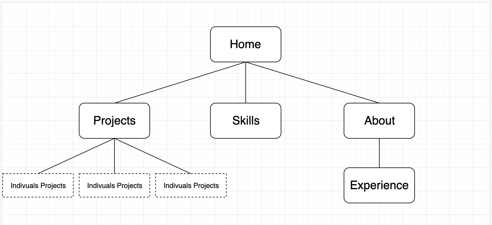

# Derek Liu

## Portfolio (A1-3)

### <u>GitHub Link</u>

<https://github.com/liuderek97/HTML-Portfolio>

### <u>Website Link</u>

<https://derekliuportfolio.netlify.com](https://derekliuportfolio.netlify.com/>

## Purpose

To create a portfolio website to convey to potential employers the skills that I have with certain tech stacks and to demonstrate my capabilities in front end development, and allow for universal access on all devices.

## Functionality/Features

The portfolio website contains the following information:

- Projects and programs that I have worked on and developed during my studies and work.
- Skill and tech stacks that I am capable of developing in and using 
- Information about myself to let potential employees learn more about me
- Previous work experience 

## Sitemap

 
## Website Screenshots

### Desktop Screenshots

     

 \  

\   

 \

 \

  \  
