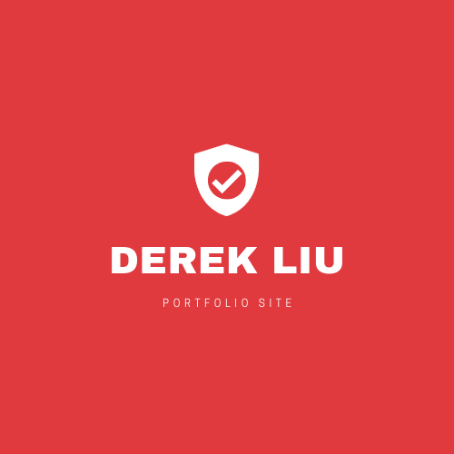

# Derek Liu

## Portfolio (A1-3)

### <u>GitHub Link</u>

<https://github.com/liuderek97/HTML-Portfolio>

### <u>Website Link</u>

<https://derekliuportfolio.netlify.com/>

## Purpose

To create a portfolio website to convey to potential employers the skills that I have with certain tech stacks and to demonstrate my capabilities in front end development, and allow for universal access on all devices.

## Functionality/Features

The portfolio website contains the following information:

- Projects and programs that I have worked on and developed during my studies and work.
- Skill and tech stacks that I am capable of developing in and using 
- Information about myself to let potential employees learn more about me
- Previous work experience 

## Sitemap

## Website Screenshots - Desktop Screenshots

  

 

  

  

  

## Website Screenshots - Mobile Screenshots

## Targert Audience 

The main target audience for this site are potential employees, collaborators or individuals who would like to learn more about my technology background and skills and personal portfolio.

## Tech Stacks Used

In order to complete and deploy this website I utilised the following tech stacks:
* HTML5
* CSS3
* Netify; to deploy the live site
* Github

## Design Process

In order to come up with a design scheme for the site the following resources were used:
* Pinterest
* Khroma color picker
* Google Fonts
* trello 
* Balsamiq Mockups
* Github

### Pinterest

Pinterest is an social media application that allows users to upload and view images, as well as create a collection of images called "Pinterest Boards". Pinterest was employed to create a moodboard in order to gain inspiration for a web layout theme, as well as colour them. A moodboard was created and a number of thematically  similar websites were added to the moodboard to help narrow down the design scheme. After creating a moodboard Khroma was then utilised to select the colours.

Moodboard Link: <https://www.pinterest.com.au/liuderek97/website-mood-board/>

### Khroma

Khroma is an online color pallete picker that allows for users to view a number of color palletes and gradients based on the user color preferences. Khroma was the main color picking pallete tool that was utilised in the design process, in order to come up with an aesthetic color scheme that fitted the desired theme. After using Khroma the following colours were selected to be used in the website:

### Google Fonts

Google Fonts is an online of free licensed fonts and was the main resource that was used when choosing a suitable font for the design. Google fonts was also used as it had a large collection of fonts and made finding fonts easy and accessible. The chosen font for the website was: Robot sans serif. Roboto was chosen as it was subjectively the most aesthetic font and would fit well with the overall theme of the site.

### Trello

In order to keep on top of the Project a Trello board was created to ensure that each task and step of the design process was planned out and to ensure that each task had a deadline. When a task was created, a deadline was assigned to the specific task, the task status would then be updated or commented about if any progress had been made.

### Balsamiq Mockups

Balsamiq is wireframing tool that was employed during the plannnig stages of the project in order to create rough and schematic layout of how the website would look. Several wireframes were created using balsamiq and the wireframes created were representative of how the site would look. Wireframes were created for different devices such as desktop mobile and different mobile phone models. Balsamiq and the creation of wireframes was imperative to the design process as it provided a scheme to follow and a reference point for the styling of the site on different devices. After the creation of the wireframes for all devices the development of the site was then commenced.

### Wireframes

### Github

Github was the chosen platform for application version control. Github was chosen due to the fact that it would allow for the code to be available on multiple devices. Any changes made to the code would be documented during the committing stage. This allowed anyone working on the project to constantly be aware of any major changes to the code and keep up to date with the latest revisions of the project. 

### Logo

The website Logo was created using canva and is used on the about me page.

### Usability Considerations

When designing the website the main design philosophy was to always present the user with useful information and ensure that the user had a way of quickly and easily navgigating the site. In order to do this a clean and simplistic design philosophy was adopted and implemented into the site. When first arriving at the site the user is presented with a hero image and text explaining to the user the purpose of the site and allowning the user to navigate to other sites such as linkedin, github and twitter. The website also has a sticky navabr that is always present on the screen in order to allow for the user to jump top a desired section. The sticky navbar that is consistently present was also implemented as the website itself is quite long, and the navbar eliminates the need for the user to scroll.

The website also provides certain feedback to the user to allow them to instantaneously be aware of their actions. For example when hovering over a certaing project or skill the icon will enlargen and change colour. Furthermore whenever a user clicks on a link that leads to an external site, the link is opened up in a new tab. This will allow the user to access the site more easily as it will prevent backtracking for the user. The implemention of smooth when clicking on a link was implemented as the website wasn't long enough to the point where smooth scrolling would hinder the progress of the user, and would make for a more aesthetically pleasing experience for ther user in contrast to instant jumping to certain section. The font size was also made to be relatively large to allow access to users with poor eyesight.

                                          
                                           
                                         
